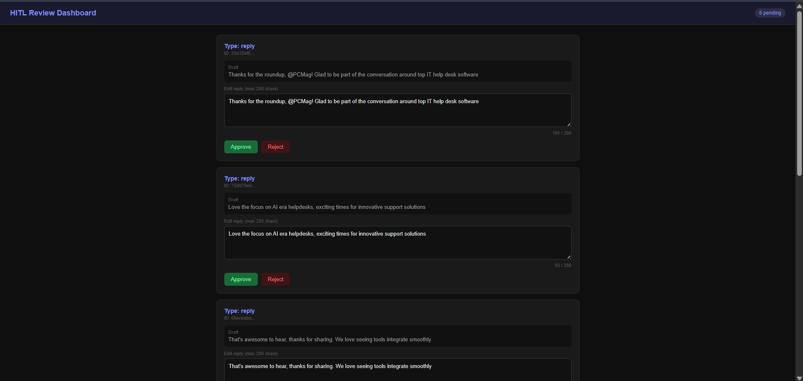

# TechDesk AI — Autonomous Multi-Agent Social Intelligence System

> **TL;DR**: An AI-native, event-driven system that monitors social platforms in real time, generates grounded responses using RAG, enforces safety via human-in-the-loop, and improves continuously using feedback loops (RLHF + bandits).

---

## 🖼️ Dashboard Preview



> Real-time Human-in-the-Loop (HITL) dashboard for reviewing and approving AI-generated responses

---

## 🚀 Overview

TechDesk AI is a production-grade autonomous system designed to:

* Monitor social platforms (Reddit, LinkedIn, Twitter)
* Understand intent using LLMs
* Generate contextual, on-brand responses
* Route decisions through a multi-agent architecture
* Continuously improve using feedback loops

Unlike typical LLM apps, this system is built as a **complete AI system**, not just a prompt wrapper.

---

## 🧠 Core Idea

LLMs are **probabilistic systems**, not deterministic tools.

This system is designed to:

* Ground outputs → (RAG)
* Validate outputs → (HITL)
* Monitor behavior → (Audit logs)
* Improve over time → (RLHF + Bandits)

---

## 🏗️ Architecture — 7 Layers

```text
┌─────────────────────────────────────────────┐
│ Perception                                 │
│ Reddit · LinkedIn · Twitter → Kafka        │
├─────────────────────────────────────────────┤
│ Understanding                              │
│ Intent · Sentiment · Entity extraction      │
├─────────────────────────────────────────────┤
│ Planning                                   │
│ LangGraph routing · Strategy selection      │
├─────────────────────────────────────────────┤
│ Memory                                     │
│ PostgreSQL + pgvector · Redis               │
├─────────────────────────────────────────────┤
│ Action                                     │
│ Response generation · Formatting            │
├─────────────────────────────────────────────┤
│ Safety                                     │
│ Filters · Toxicity detection · HITL         │
├─────────────────────────────────────────────┤
│ Observability                              │
│ Audit logs · RLHF · Strategy tracking       │
└─────────────────────────────────────────────┘
```

---

## 🤖 Multi-Agent System

```text
            ┌───────────────┐
 Signal ──► │ Orchestrator  │
            └──────┬────────┘
                   │
      ┌────────────┼────────────┐
      ▼            ▼            ▼
 ┌──────────┐ ┌──────────┐ ┌──────────────┐
 │Engagement│ │  Crisis  │ │ContentCreator│
 │  Agent   │ │  Agent   │ │    Agent     │
 └──────────┘ └──────────┘ └──────────────┘
      │            │            │
      └────────────┴────────────┘
                   ▼
             ┌───────────┐
             │ Safety    │
             │  Gate     │
             └────┬──────┘
                  ▼
            ┌────────────┐
            │ HITL Queue │
            └────────────┘
```

### Agents

* **Orchestrator** → intent classification + routing
* **Engagement** → normal responses (RAG + persona)
* **Crisis** → high-risk escalation
* **ContentCreator** → proactive/viral content

---

## 🔁 AI Engineering Workflow

1. Generate → LLM response
2. Ground → RAG retrieval
3. Validate → Human-in-the-loop
4. Log → Audit trail
5. Learn → RLHF + Bandits

---

## ⚙️ Production-Grade Optimizations

### Prompt Engineering

* Structured prompts with output schemas
* Role-based constraints per agent

### Hallucination Reduction

* RAG with pgvector
* Context injection before generation

### Safety

* Keyword filtering + toxicity detection
* HITL approval for high-risk outputs

### Observability

* Kafka event streaming
* Append-only audit logs for all LLM calls

### Learning & Optimization

* RLHF preference collection
* Contextual bandit (epsilon-greedy)

---

## 🧰 Tech Stack

| Layer     | Technology               |
| --------- | ------------------------ |
| Backend   | Python, FastAPI          |
| Agents    | LangGraph                |
| LLM       | Llama 3.3 70B (Groq API) |
| Streaming | Apache Kafka             |
| Database  | PostgreSQL + pgvector    |
| Cache     | Redis                    |
| Infra     | Docker                   |

---

## 📂 Project Structure

```text
AI-Social-Agent/
├── services/
│   ├── perception/
│   ├── agents/
│   ├── safety/
│   ├── hitl/
│   ├── rag/
│   └── rlhf/
├── shared/
├── scripts/
├── infra/
```

---

## 🗄️ Database Schema

| Table            | Purpose                 |
| ---------------- | ----------------------- |
| signals          | Incoming social signals |
| actions          | Agent outputs           |
| knowledge_base   | RAG data                |
| audit_log        | LLM call logs           |
| preference_pairs | RLHF data               |

---

## 📡 Kafka Topics

| Topic                     | Purpose            |
| ------------------------- | ------------------ |
| social.signals.raw        | Raw signals        |
| social.signals.classified | Classified signals |
| agent.actions.draft       | Drafts             |
| agent.actions.approved    | Approved           |
| agent.actions.published   | Final outputs      |

---

## 🧪 Example Flow

1. Signal detected
2. Intent classified
3. Context retrieved
4. Agent selected
5. Response generated
6. Safety + HITL
7. Logged + feedback

---

## 🧠 Key Engineering Decisions

* LangGraph → explicit control
* Kafka → durable streaming
* pgvector → simple vector search
* Groq → fast inference
* fastembed → local embeddings

---

## 📊 What This Demonstrates

* AI-native system design
* Multi-agent orchestration
* Production-level safety
* Feedback-driven optimization

---

## 🔗 Repository

[https://github.com/ankitnegi-dev/Techdesk-ai-social-agent](https://github.com/ankitnegi-dev/Techdesk-ai-social-agent)

---

## 👤 Author

Ankit Negi

---

## 💬 Note to Reviewers

Happy to discuss:

* Architecture tradeoffs
* Prompt engineering strategy
* Failure cases & mitigations
* Scaling approach

> *"Build one layer at a time. Iterate on real data. The best agents are built by engineers who keep learning."*
